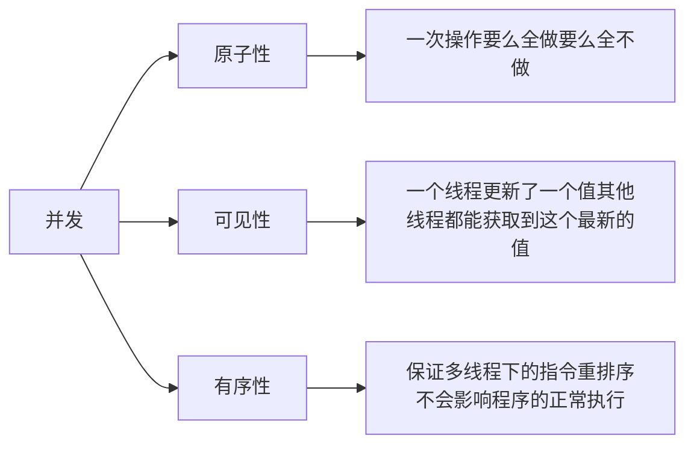

# volatile和synchronized

## volatile

之前的Java内存模型中，有这样的模型架构图。

{ thumbnail="true" }

在Java中如何保证线程本地内存和主内存之间的一致性呢？`volatile`关键字是一种解决办法。

并发编程有三大特性：

而`volatile`关键字可以解决**可见性**的问题。线程在读取被`volatile`关键字修饰的变量时，会被强制从主内存中读取，而非线程的本地内存。

JVM是如何做到让线程强制从主存中读取变量呢？这是`volatile`的两个特性决定的。

- 线程更新了被`volatile`修饰的变量后，会被JVM强制刷新到主存（立刻马上）。
- 一旦主存中的变量被刷新，其他线程中缓存的数据会失效（立刻马上）。

在其他文章中有更学术的说法：

> 写屏障（Store Barrier）：在 volatile 变量的写操作之后插入写屏障，确保所有之前的写操作都同步到主内存中，从而使得其他线程在读取该变量时能够获取到最新的值。
> 
> 读屏障（Load Barrier）：在 volatile 变量的读操作之前插入读屏障，确保所有之前的写操作都已完成，从而读取到的是最新的值。

但是看到这里仍有疑惑，在读屏障中如何“确保所有之前的写操作都已完成”？其他的线程如何知道现在这个变量正有一个写的操作呢？这估计是更底层的原因了，暂时还没看到答案。

但是`volatile`只能保证变量的可见性，不能保证原子性。用经典的一行代码`i++`举例说明：

1. 用`volatile`修饰变量i。
2. 首先读取i当前的值，此步由于`volatile`的存在，i的值必定是新值。
3. 使用i+1，得到计算后的值。
4. 将计算后的值赋予i。
5. 由于`volatile`的存在，i的新值会被立刻更新到主存。

但是在上面的第三步和第四步执行的时候，i的值可能已经被其他线程更新过了。所以最终提交到主存的i值不一定是正常的值。

## synchronized

如果`volatile`不能解决原子性的问题，我们还有什么选择呢？答案就是`synchronized`。（当然不止这一个答案）

`synchronized`在早期的Java中是一个比较消耗性能的同步工具，因为早期的`synchronized`关键字的底层完全依赖于操作系统，依赖的点就是Java对象的 ***监视器锁***。

监视器锁在Java1.6版本之前依赖操作系统的`Mutex Lock`来实现，而这个锁会将线程从用户态切换到内核态，这个过程非常耗时。

之后的版本里，Java对`synchronized`进行了很多的优化，包括自旋锁、偏向锁、轻量级锁、锁消除、锁粗化等。其中偏向锁从JDK15开始就标记为待废弃，到了JDK18已经完全不能使用。

说起来偏向锁的设计本身也只对老的`Vector`和`HashTable`这种集合类有用，在JDK1.8之后，新的代码几乎都采用更好的策略应对并发，偏向锁的退出也理所当然。