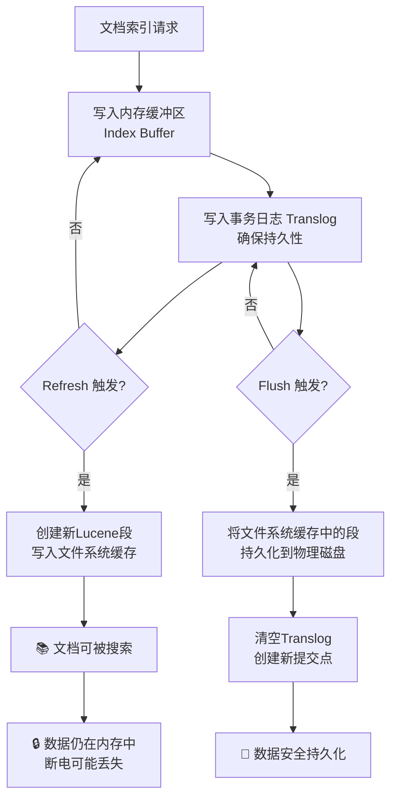

# ES的refresh和flush的区别

如果对ES的索引过程有所了解，就能很好的理解refresh和flush的区别。

这两种操作都是在ES的索引过程中发生的，但是目的不同，并且执行时间也不同。

## 核心区别总结

| 特性         | **Refresh**      | **Flush**         |
|------------|------------------|-------------------|
| **主要目的**   | 使文档**可被搜索**（近实时） | 确保数据**持久化到磁盘**    |
| **对搜索的影响** | ✅ 使新文档立即可搜索      | ❌ 不影响文档的可搜索性      |
| **数据安全**   | ❌ 不保证数据安全        | ✅ 保证数据安全，持久化到磁盘   |
| **性能影响**   | 小（内存操作）          | 大（磁盘 I/O 操作）      |
| **触发频率**   | 高（默认 1 秒）        | 低（根据 translog 大小） |

---

## 详细解析

### 1. **Refresh（刷新） - 为了搜索**

#### 什么是 Refresh？ {id="refresh_1"}
```java
// Refresh 的简化过程
public void refresh() {
    // 1. 将内存缓冲区(In-memory Buffer)中的文档写入新的 Lucene 段
    List<Document> buffer = indexBuffer.clear();
    LuceneSegment newSegment = createNewSegment(buffer);
    
    // 2. 将新段写入文件系统缓存(OS Cache)
    writeToOsCache(newSegment);
    
    // 3. 打开段，使其可被搜索
    openSegmentForSearch(newSegment);
}
```

#### Refresh 的特点： {id="refresh_2"}
- **近实时搜索**：文档在索引后约 1 秒变得可搜索
- **内存操作**：主要发生在文件系统缓存，不直接写磁盘
- **高频操作**：默认每秒一次，可通过 `index.refresh_interval` 配置

#### Refresh 配置示例：
```json
// 设置刷新间隔为 30 秒
PUT /my_index/_settings
{
  "index.refresh_interval": "30s"
}

// 完全关闭自动刷新（适合批量导入）
PUT /my_index/_settings
{
  "index.refresh_interval": "-1"
}

// 手动触发刷新
POST /my_index/_refresh
```

### 2. **Flush（刷盘） - 为了持久化**

#### 什么是 Flush？ {id="flush_1"}
```java
// Flush 的简化过程
public void flush() {
    // 1. 将文件系统缓存中的所有段持久化到磁盘
    syncAllSegmentsToDisk();
    
    // 2. 清空事务日志(translog)，创建新的 translog
    translog.clear();
    translog.createNew();
    
    // 3. 创建提交点(commit point)
    createCommitPoint();
}
```

#### Flush 的特点： {id="flush_2"}
- **数据安全**：确保数据物理写入磁盘
- **磁盘 I/O**：性能开销较大
- **低频操作**：基于 translog 大小自动触发

#### Flush 触发条件：
```bash
# 1. translog 大小达到阈值（默认 512MB）
index.translog.flush_threshold_size: "512mb"

# 2. 时间间隔（默认 30 分钟）
index.translog.flush_threshold_period: "30m"

# 3. 操作次数达到阈值（默认不限）
index.translog.flush_threshold_ops: "unlimited"
```

---

## 可视化数据流

让我们通过一个流程图来理解这两个操作在数据流转中的位置：



---

## 实际场景示例

### 批量数据导入优化
```java
// 1. 关闭自动刷新以提高导入速度
PUT /large_data/_settings
{
  "index.refresh_interval": "-1",
  "index.translog.durability": "async"  // 异步 translog
}

// 2. 执行批量导入
POST /large_data/_bulk
{ "index": {} }
{ "data": "value1" }
{ "index": {} }
{ "data": "value2" }

// 3. 导入完成后手动刷新
POST /large_data/_refresh

// 4. 确保数据持久化
POST /large_data/_flush
```

### 高实时性搜索场景
```java
// 需要快速搜索，但可以接受少量数据丢失风险
PUT /realtime_index/_settings
{
  "index.refresh_interval": "1s",           // 快速刷新
  "index.translog.sync_interval": "5s",     // translog 5秒刷一次
  "index.translog.durability": "async"      // 异步持久化
}
```

---

## 监控和管理

### 查看 Refresh 和 Flush 统计
```bash
# 查看索引的 refresh 统计
GET /_stats/refresh?pretty

# 查看索引的 flush 统计  
GET /_stats/flush?pretty

# 输出示例：
{
  "_shards": { ... },
  "_all": {
    "primaries": {
      "refresh": {
        "total": 100,           // 总 refresh 次数
        "total_time_in_millis": 5000  // 总耗时
      },
      "flush": {
        "total": 5,             // 总 flush 次数
        "total_time_in_millis": 2000  // 总耗时
      }
    }
  }
}
```

### 手动操作 API
```bash
# 手动刷新（使文档可搜索）
POST /my_index/_refresh

# 手动刷盘（确保数据持久化）
POST /my_index/_flush

# 刷盘并等待所有操作完成
POST /my_index/_flush?wait_if_ongoing=true
```

---

## 总结

**简单记忆：**
- **Refresh** = **"让我搜到"** → 解决搜索实时性问题
- **Flush** = **"帮我存盘"** → 解决数据安全问题

**关键要点：**
1. **Refresh 影响搜索可见性**，但不保证数据安全
2. **Flush 影响数据持久性**，但不影响搜索可见性
3. 两者协同工作，通过 **Translog** 机制保证在 Refresh 频繁执行时数据也不会丢失
4. 根据业务场景（实时搜索 vs 批量导入）合理配置这两个参数可以显著提升性能
