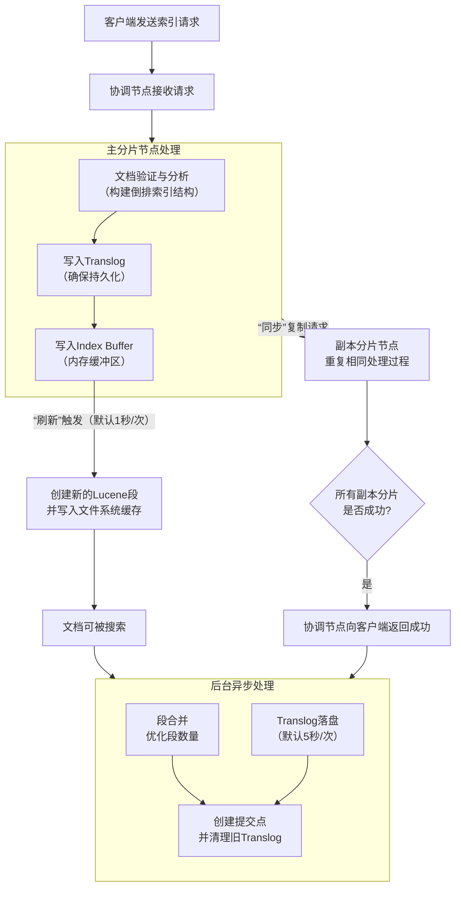

# 详解Elasticsearch的索引过程

## 核心概念先行

在深入过程之前，先明确几个关键概念：

1.  **索引**：在 Elasticsearch 中，索引是具有相似特征的文档的集合。它类似于关系型数据库中的**表**。
2.  **文档**：索引中的基本数据单元，是可以被索引的基本信息单元。类似于表中的一行**记录**，通常为 JSON 格式。
3.  **分片**：索引可以被分割成多个部分，每个部分称为一个分片。这允许你水平拆分/缩放数据量，并执行跨分片的分布式操作。
    *   **主分片**：每个文档只存在于一个主分片中，是数据读写的主要载体。
    *   **副本分片**：每个主分片可以有零个或多个副本。副本是主分片的完整拷贝，提供数据冗余和高可用性。
4.  **倒排索引**：这是 Elasticsearch 实现快速全文搜索的核心数据结构。它通过创建“词项 -> 文档ID”的映射，而不是“文档ID -> 内容”的映射。简单来说，它先对文档内容进行分词，然后记录每个词出现在哪些文档中。

## 索引过程的详细步骤

假设我们有一个名为 `products` 的索引，我们要向其中索引一条新的文档（例如，一个商品信息）。整个过程可以从两个维度来看：**单个分片内的处理**和**分布式层面的协调**。

下图清晰地展示了一个文档从被客户端发出，到最终在Elasticsearch集群中变得可搜索与持久化的完整旅程，其中包含了关键的内存操作、文件系统交互与分布式协调：

### 第1步：客户端请求与协调节点路由

1.  你的应用程序（客户端）向 Elasticsearch 集群中的**某个节点**发送一个 HTTP PUT 或 POST 请求（例如 `PUT /products/_doc/1`）。
2.  接收到请求的这个节点现在扮演**协调节点** 的角色。
3.  协调节点根据文档的 ID（这里是 `1`）和索引的**路由规则**（默认情况下是 `id % 主分片数量`），计算出这个文档应该被存储在哪个**主分片**上。假设它计算出这个文档属于 `P0` 主分片。
4.  协调节点将请求转发到持有 `P0` 主分片的**数据节点**。

### 第2步：主分片节点的内部处理 {id="2_1"}

请求到达持有 `P0` 主分片的数据节点后，一系列操作在该分片内发生：

1.  **文档验证与分析**：
    *   节点会验证收到的 JSON 文档格式。
    *   根据索引的**映射**，对各个字段进行处理。例如，对于 `text` 类型的字段，会进行**分词**，将其转换成一系列词项，为构建倒排索引做准备。

2.  **写入操作**：
    *   **写入事务日志**：首先，将操作（包括文档内容和要索引的指令）追加到 **Translog** 中。Translog 是一个仅追加的、在硬盘上的日志，用于防止数据丢失。这是确保**持久性**的关键第一步。
    *   **写入内存缓冲区**：随后，文档数据被写入到 **Index Buffer**（索引缓冲区）。这个缓冲区是内存中的一块区域，用于暂存即将被写入到索引中的文档。

    此时，文档在**主分片**上的初始写入就完成了。但此时它还**不能被搜索到**，因为它仍在内存缓冲区中，尚未被写入到真正的索引结构里。

### 第3步：刷新 - 使文档可搜索

3.  **刷新**：
    *   这是一个非常重要的过程。默认情况下，Elasticsearch 每秒执行一次**刷新**操作。
    *   刷新会做以下几件事：
        a. 将 Index Buffer 中的所有文档清空，并创建一个新的 **Lucene 段**。
        b. 这个段首先被写入到文件系统的缓存中（此时尚未物理写入磁盘，所以速度很快）。
        c. 段被打开，使得其中的文档变得**可被搜索**。

    这就是为什么 Elasticsearch 被称为 **“近实时”** 搜索引擎。文档在索引后，通常会在 1 秒内变得可搜索，而不是立即。

### 第4步：副本同步 - 确保高可用性

在**主分片**成功处理文档的同时，分布式过程也在进行：

4.  **复制到副本分片**：
    *   主分片节点会将索引操作并行地发送到所有其**副本分片**（例如 `R0`）所在的数据节点。
    *   每个副本分片会重复与主分片**完全相同的内部处理过程**：写入自己的 Translog，写入自己的 Index Buffer，等待刷新。
    *   Elasticsearch 会等待**所有副本分片**报告成功（或达到规定的最小成功副本数）。这个一致性级别可以通过 `wait_for_active_shards` 参数配置。

### 第5步：响应客户端

5.  一旦**主分片**和规定的**副本分片**都成功完成了操作（即写入了 Translog 和 Index Buffer），最初持有 `P0` 主分片的节点就会向**协调节点**报告成功。
6.  协调节点最终向客户端返回一个成功的响应（例如，HTTP 状态码 201）。

---

## 后台持久化与优化

上述步骤已经完成了一次索引请求的核心生命周期。但为了让数据更安全、性能更优，还有一些重要的后台进程在持续运行：

### 1. Translog 的刷新与段的重写

*   **Translog 落盘**：虽然 Translog 在硬盘上，但数据可能还在操作系统的缓存中。为了确保数据安全，Elasticsearch 会定期执行 `fsync` 操作，将 Translog 真正刷到物理磁盘上。这个间隔由 `index.translog.sync_interval` 控制（默认 5 秒）。你也可以设置为每个请求都刷盘（`request`），但这会影响性能。
*   **段合并**：由于每次刷新都会创建一个新的段，会导致段数量过多，影响搜索性能和资源占用。Elasticsearch 会在后台自动进行**段合并**，将多个小的段合并成更大的段，并移除已删除的文档。这个过程是 I/O 和 CPU 密集型的。

### 2. 提交

*   当 Translog 变得太大（由 `index.translog.flush_threshold_size` 控制）或达到一定时间间隔时，Elasticsearch 会执行一次**提交**。
*   提交会做以下几件事：
    a. 将内存中所有已刷新的段永久地、物理地写入到磁盘。
    b. 清除当前的 Translog，并创建一个新的空 Translog。
    c. 创建一个**提交点**，这是一个文件，用来记录当前哪些段是活跃的，并已写入磁盘。

这个过程类似于数据库的检查点，它确保了数据的持久化，并允许在故障恢复时从一个已知的良好状态开始。

---

## 总结

Elasticsearch 的索引过程是一个精心设计的、权衡了**速度**、**持久性**和**可用性**的过程：

*   **近实时搜索**：通过 **“内存缓冲区 + 每秒刷新”** 机制实现。
*   **数据安全**：通过 **Translog** 确保即使宕机，数据也能从日志中恢复。
*   **高可用性**：通过**主从分片模型**和**同步复制**实现。
*   **性能与压缩**：通过后台**段合并**来优化索引结构和资源使用。

## 可以思考的问题

1. 在哪些情况下，索引操作会失败？
2. 在哪些时刻，服务器断电会导致数据丢失？
3. 如果在处理索引请求时，协调节点和数据节点不是同一个节点，那么返回给客户端的响应是由协调节点响应还是数据节点？
4. ES中flash和refresh的区别是什么？（可以单开一篇文章了）