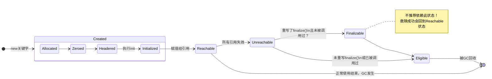

# Java中一个对象的前世今生

一个Java对象的完整生命周期可以概括为以下几个阶段：

1.  **创建（Creation）**
2.  **使用（In Use）**
3.  **不可达（Inaccessible）**
4.  **可回收（Eligible for Collection）**
5.  **最终化（Finalization）**（可选，但不推荐依赖）
6.  **回收（Reclaimed）**

下面我们逐一进行详细解释。

---

## 1. 创建（Creation） - `new` 关键字

当你在代码中执行 `MyClass obj = new MyClass();` 时，JVM会完成一系列操作：

*   **类加载检查**：JVM首先检查`MyClass`这个类是否已经被加载、链接和初始化。如果没有，则会先执行类加载过程。
*   **内存分配**：JVM在堆内存（Heap）中为新生对象分配一块确定大小的内存空间。分配方式取决于Java堆的规整度和采用的垃圾收集器，主要有两种：
    *   **指针碰撞（Bump the Pointer）**：如果堆内存是绝对规整的（即所有用过的内存放在一边，空闲的内存放在另一边），那么分配内存仅仅是将指向空闲内存的指针向空闲空间方向挪动一段与对象大小相等的距离。
    *   **空闲列表（Free List）**：如果堆内存不规整，JVM需要维护一个列表，记录哪些内存块是可用的。在分配时，从列表中找到一个足够大的空间分配给对象实例，并更新列表记录。
*   **内存空间初始化**：将分配到的内存空间（不包括对象头）都**初始化为零值**。这保证了对象的实例字段在不赋初值的情况下也能直接使用其默认值（如`int`是0，`boolean`是`false`，引用类型是`null`）。
*   **设置对象头（Object Header）**：JVM在对象上设置必要的元数据信息，存储在对象头中。这些信息包括：
    *   哈希码（HashCode）
    *   GC分代年龄（对象熬过垃圾收集的次数）
    *   锁状态标志
    *   指向该对象的类元数据（Class Metadata）的指针（即确定该对象是哪个类的实例）
*   **执行构造方法（`<init>`）**：最后，执行`new`关键字后面的构造方法。按照构造方法的意图进行初始化（为字段赋真正的初始值），形成一個真正可用的对象。

至此，一个对象已经在堆中创建完毕，并且栈帧中的引用变量 `obj` 指向了这个对象。

---

## 2. 使用（In Use）

对象创建后，程序就可以通过栈上的引用 `obj` 来操作堆中的这个对象实例，比如调用其方法、访问其字段。在此阶段，该对象处于“可达”状态，即从GC Roots（如虚拟机栈的局部变量表、静态变量、常量等）出发，可以通过引用链找到这个对象。

**这是对象生命的主要阶段。**

---

## 3. 不可达（Inaccessible）与可回收（Eligible for Collection）

当对象不再被任何地方引用时，它的生命就开始走向终结。

*   **不可达**：当方法的局部变量（引用）超出了作用域，或者将引用变量显式地设置为`null`（例如 `obj = null;`），或者引用被重新赋值指向了另一个对象时，原先的对象就失去了与GC Roots的连接，变成了“不可达”对象。
*   **可回收**：不可达的对象并不意味着会立即被销毁。它只是意味着它已经成为了垃圾收集器的**待回收目标**，即处于“可被回收”的状态。

**注意**：对象不可达是成为垃圾的必要条件，但并非所有不可达对象都会立刻被回收，这取决于垃圾收集器何时运行。

---

## 4. 最终化（Finalization）（可选且不推荐依赖）

如果一个类重写了 `Object` 类的 `finalize()` 方法，那么在该对象被垃圾回收器真正回收**之前**，会有一个额外的步骤：

1.  垃圾收集器会判断这个对象是否重写了 `finalize()` 方法且该方法尚未被调用过。
2.  如果是，JVM会将该对象放入一个名为 **F-Queue** 的队列中。
3.  由一个由JVM创建的低优先级的 **Finalizer线程** 去异步地执行队列中各个对象的 `finalize()` 方法。
4.  在执行 `finalize()` 方法时，对象有一次“自我救赎”的机会，即在方法中将自己（this）重新赋值给某个类变量或实例变量，从而再次变为可达状态，避免被回收。
5.  如果对象在 `finalize()` 中没有成功“救赎”自己，那么它基本上就难逃被回收的命运了。

**重要警告**：
*   `finalize()` 方法的执行时机是不确定的，甚至不能保证它一定会被执行（比如JVM突然崩溃退出）。
*   `finalize()` 方法的运行性能很差，而且机制复杂。
*   使用不当可能导致严重的资源泄漏、死锁和程序崩溃。

**因此，Java 9之后，`finalize()` 方法已被标记为`@Deprecated`。完全不应该依赖它来释放关键资源（如文件句柄、数据库连接）。正确的做法是使用 `try-with-resources` 语句或显式调用 `close()` 方法来管理资源。**

---

## 5. 回收（Reclaimed）

当垃圾收集器（Garbage Collector, GC）开始运行时（通常是因为JVM觉得内存不足了），它会扫描堆内存。

*   **标记（Mark）**：GC会从所有GC Roots开始，遍历所有能被引用的对象，并对其进行标记。所有未被标记的对象（即之前提到的不可达对象）就是需要被回收的垃圾。
*   **清理/回收（Sweep/Reclaim）**：对于标记为垃圾的对象，不同的垃圾收集器会采用不同的算法进行内存回收。常见的有：
    *   **标记-清除（Mark-Sweep）**：直接清除垃圾对象占用的内存。会产生内存碎片。
    *   **标记-复制（Mark-Copy）**：将存活的对象复制到另一块内存区域，然后清空当前区域。效率高，无碎片，但浪费空间。
    *   **标记-整理（Mark-Compact）**：让所有存活的对象都向内存空间的一端移动，然后直接清理掉边界以外的内存。无碎片，但效率较低。

对象占用的内存被回收后，这块内存就又回到了空闲状态，可以分配给新的对象使用。

---

## 总结与图示

对象的生命周期可以简化为一个清晰的流程：

`new` -> **分配内存 & 初始化零值 & 设置对象头 & 执行`<init>`** -> **对象处于“可达”状态** -> **业务逻辑使用** -> **引用断开** -> **对象处于“不可达/可回收”状态** -> **(可选且不推荐) 执行 `finalize()`** -> **垃圾收集器回收内存**

为了更直观地理解对象在内存中的状态流转，可以参考以下状态图：

## 可以思考的问题

1. 对象new出来之后一定会在堆中创建吗？
2. 对象创建后一定会被分配在年轻代吗？