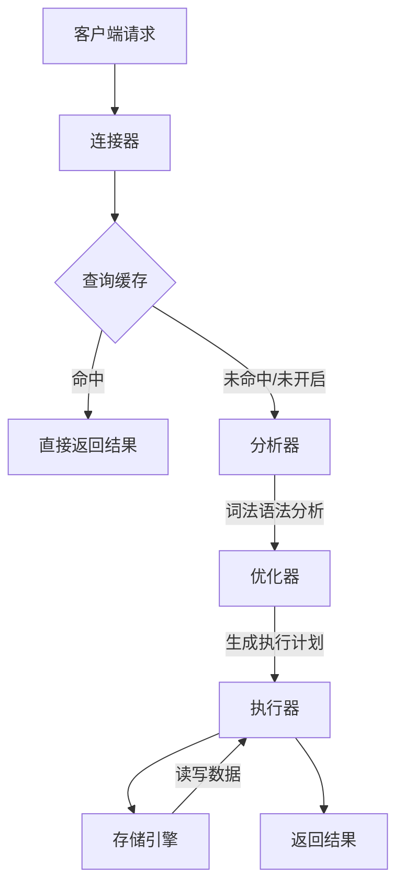

# MySQL中执行一次数据库查询的完整流程

要搞清楚MySQL中一个 SQL 查询的完整流程，首先我们需要了解MySQL的基础架构。

我们可以将MySQL的架构分为两个层次：**Server 层**和**存储引擎层**。

*   **Server 层**：这是 MySQL 的核心服务层，包含大多数核心功能。所有跨存储引擎的功能都在这一层实现，比如连接管理、权限认证、SQL 解析、优化等。
*   **存储引擎层**：负责数据的存储和提取。其架构模式是插件式的，支持 InnoDB、MyISAM、Memory 等多个存储引擎。最常用的是 InnoDB。

---

## 整体流程

我们可以用下图来概括整个执行流程，后续再对每个步骤进行详细解释。

---

## 步骤一：连接器（Connector）

1.  **功能**：管理客户端的连接、身份认证和权限校验。
2.  **详细过程**：
    *   客户端（应用程序、命令行工具等）发起连接请求，提供用户名、密码和主机信息。
    *   连接器验证用户名和密码是否正确。如果错误，返回 `"Access denied for user"` 错误，连接失败。
    *   认证通过后，连接器会到权限表里查出该用户拥有的权限。**这个连接后续的权限判断逻辑，都将依赖于此时读到的权限**。这意味着，即使管理员在连接建立后修改了该用户的权限，也不会影响已经存在的连接，只有新建的连接才会使用新的权限设置。
    *   连接建立后，如果客户端长时间（由 `wait_timeout` 参数控制，默认 8 小时）没有活动，连接器会自动将其断开。

**注意**：由于建立连接的成本较高，通常建议使用**数据库连接池**来管理连接，避免频繁创建和销毁连接。

---

## 步骤二：查询缓存（Query Cache - MySQL 8.0 已移除）

*   **注意：在 MySQL 8.0 版本中，查询缓存功能已被彻底移除。** 因为只要表有更新，这个表上所有的查询缓存都会被清空，导致缓存命中率非常低，维护缓存反而带来更大的开销。但对于早期版本（如 5.7），这一步仍然存在。

1.  **功能**：缓存 SELECT 语句及其结果集。
2.  **详细过程（针对 5.7 等旧版本）**：
    *   连接建立后，执行 SQL 语句之前，MySQL 会先看看这条 SQL 是不是一条 SELECT 语句。
    *   如果是，它会先去**查询缓存**中查找，看看是否之前执行过这条完全相同的 SQL（注意：SQL 必须逐字节相同，包括空格、大小写）。
    *   如果命中缓存，MySQL 会直接返回缓存中的结果，后续步骤不再执行，效率极高。
    *   如果没有命中缓存，或者不是 SELECT 语句，则继续后续流程。
    *   对于任何涉及数据修改的语句（INSERT, UPDATE, DELETE等），执行完成后会使相关表的查询缓存全部失效。

---

## 步骤三：分析器（Parser）

1.  **功能**：进行“词法分析”和“语法分析”，理解 SQL 语句的含义。
2.  **详细过程**：
    *   **词法分析**：MySQL 需要识别出字符串中的内容分别是什么。例如，它会把 `"SELECT"` 这个关键字识别出来，知道这是一个查询语句；把 `"T"` 识别成“表名 T”；把 `"ID"` 识别成“列 ID”。
    *   **语法分析**：根据词法分析的结果，语法分析器会根据 MySQL 的语法规则，判断你输入的 SQL 是否满足 MySQL 的语法。如果语句不对，就会收到 `"You have an error in your SQL syntax"` 的错误提醒，比如 `SELECT` 少打了个 `S`，写成 `SELEC`。

**这一步就像编译器编译源代码一样，确保语句的合法性。**

---

## 步骤四：优化器（Optimizer）

1.  **功能**：在多种可能的执行方案中，选择一个它认为最优的方案来执行。
2.  **详细过程**：
    *   经过分析器，MySQL 知道你要做什么了。但在开始执行之前，需要先经过优化器的处理。
    *   优化器会决定：
        *   **选择哪个索引**：如果表中有多个索引，优化器会决定使用哪个索引能使查询速度最快（基于成本估算，而非时间估算）。
        *   **多表关联（JOIN）的顺序**：当需要连接多个表时，决定先连接哪个表，后连接哪个表，效率最高。
        *   **子查询优化**：将一些子查询转换为更高效的 JOIN 操作。
        *   **条件化简**：对 WHERE 条件进行简化。
    *   优化器完成后，会生成一个**执行计划（Execution Plan）**。

**你可以使用 `EXPLAIN` 命令来查看优化器生成的执行计划，这对于 SQL 性能调优至关重要。**

---

## 步骤五：执行器（Executor）

1.  **功能**：操作存储引擎，执行 SQL 语句。
2.  **详细过程**：
    *   在执行之前，执行器会先判断一下该用户对表 `T` 有没有执行查询的权限。如果没有，就会返回权限错误。（注意：如果命中了查询缓存，会在缓存返回结果的时候做权限验证。）
    *   **如果有权限，就打开表开始执行**。
    *   执行器会根据表定义的存储引擎，去调用该存储引擎提供的接口。
    *   **以 `SELECT * FROM T WHERE ID = 10;` 为例**：
        *   执行器调用 InnoDB 引擎的接口。
        *   首先取表的第一行，判断 `ID` 值是不是 10，如果是，则将这行存入结果集；如果不是，则跳过。
        *   调用引擎接口取“下一行”，重复相同的判断逻辑，直到取到表的最后一行。
        *   执行器将上述遍历过程中所有满足条件的行组成记录集返回给客户端。
    *   对于有索引的情况，执行逻辑类似，但效率更高。执行器会调用引擎的“取满足条件的第一行”和“取下一行”接口，这些接口已经在引擎内部通过索引优化了。

---

## 步骤六：存储引擎（Storage Engine）

1.  **功能**：真正负责数据的存储和读取。
2.  **详细过程**：
    *   存储引擎是插件式的，不同的存储引擎数据存储格式不同。
    *   **InnoDB**：支持事务、行级锁、外键。是 MySQL 5.5 版本后的默认存储引擎。
    *   **MyISAM**：不支持事务和行级锁，查询速度快，适合读多写少的场景（但现在已不推荐使用）。
    *   执行器通过预定义好的**存储引擎 API** 与存储引擎交互。这些 API 屏蔽了不同存储引擎之间的差异。
    *   存储引擎处理执行器的请求，比如从磁盘读取数据页到内存（Buffer Pool）、将修改的数据写回磁盘等。

---

## 可以思考的问题

1. 在其他的数据库中，SQL执行流程是怎样的？与MySQL相比，其他数据库的SQL执行流程有哪些不同？
2. 客户端是通过什么方式与数据库进行通信的？连接器是如何处理这里连接的？
3. 如果使用视图进行数据查询，MySQL会如何处理？
4. 优化器具体是如何对SQL进行优化的？