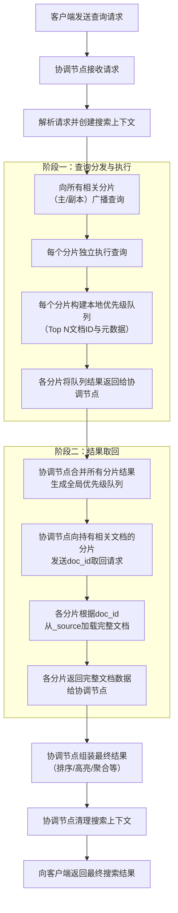

# 详解Elasticsearch的检索过程

## 核心概念回顾

在深入过程之前，先明确几个关键概念：

1.  **查询类型**：
    *   **Query**：用于查找与条件匹配的文档，并计算其相关性得分（_score）。例如 `match`, `term`, `bool` 查询。
    *   **Filter**：用于精确匹配，不计算得分，结果可以被缓存。例如 `term`（用于关键字字段）， `range`。
2.  **搜索上下文**：管理一次搜索请求所需的所有状态和信息。
3.  **分片**：索引被水平拆分的单元。查询会在所有相关的分片（主分片或副本分片）上并行执行。
4.  **协调节点**：接收客户端请求的节点，负责将请求路由到目标分片，收集和合并所有结果，最后返回给客户端。

---

## 查询请求的详细处理过程

假设我们有一个名为 `products` 的索引（有3个主分片，每个主分片1个副本），我们要搜索包含关键字 "手机" 的商品。整个过程可以分为 **查询分发、分片执行、结果合并、数据取回** 四个主要阶段。

下图清晰地展示了一条查询请求从发出到返回结果的完整分布式处理流程：

### 第1步：客户端请求与协调节点接收 {id="1_1"}

1.  你的应用程序（客户端）向 Elasticsearch 集群中的**某个节点**发送一个 HTTP GET 或 POST 请求（例如 `GET /products/_search`，并带有 JSON 查询体）。
2.  接收到请求的这个节点自动成为本次查询的**协调节点**。

### 第2步：协调节点解析与准备 {id="2_1"}

3.  **解析请求**：协调节点解析查询请求，包括：
    *   确定目标索引（可能是 `*` 通配符或多个索引）。
    *   解析查询 DSL（如 `query`， `filter`， `sort`， `from/size`， `aggs` 等）。
    *   创建**搜索上下文**，用于管理整个搜索过程的状态和资源。
4.  **确定分片**：协调节点根据集群状态，确定需要查询哪些分片。对于 `products` 索引，它会找到所有3个主分片（或者它们的副本，通常采用轮询方式以实现负载均衡）。
5.  **广播查询请求**：协调节点将查询阶段请求并行地发送到所有相关的分片（主分片或副本分片）。

---

### 第3步：查询阶段 - 在所有分片上并行执行 {id="3_1"}

6.  **分片本地查询**：
    *   每个收到请求的数据节点，在其本地分片（一个 Lucene 索引）上独立执行查询。
    *   Lucene 会使用**倒排索引**来查找包含 "手机" 这个词项的文档。
    *   对于每个匹配的文档，Lucene 会计算其相关性得分 `_score`（如果使用的是相关性查询）。
7.  **构建本地优先级队列**：
    *   每个分片并不会将所有匹配的文档都返回给协调节点，那样数据量太大。
    *   相反，每个分片会创建一个大小为 `from + size` 的**本地优先级队列**。例如，如果请求是 `"from": 10, "size": 10`，那么队列大小就是 20。
    *   这个队列用于在本地**预排序**，只保留当前分片内**得分最高**的前 `from + size` 个文档的 **ID 和排序键**（如 `_score`）。

### 第4步：合并阶段 - 协调节点汇总结果 {id="4_1"}

8.  **收集分片结果**：协调节点接收来自所有分片的本地优先级队列。
9.  **全局合并与排序**：
    *   协调节点将所有分片返回的文档 ID 和排序键合并到一个**全局优先级队列**中。
    *   这个全局队列的大小为 `from + size`。
    *   协调节点对这个全局队列进行排序，最终确定排名从 `from` 到 `from + size` 的文档是哪些。
    *   **注意**：此时协调节点只知道哪些文档需要被返回（它们的 `_id` 和所在分片），但**还没有获取文档的详细内容**（如 `_source` 字段）。

---

### 第5步：取回阶段 - 获取文档数据

10. **发起取回请求**：协调节点现在已经知道最终要返回的文档列表（例如第10到第19名的文档）。它向这些文档所在的**具体分片**发送 `multi-get` 请求，请求获取这些文档的 `_source` 和其他需要的字段。
11. **分片获取文档**：各个数据节点收到 `multi-get` 请求后，从本地的 Lucene 索引中加载指定文档的完整内容。
12. **返回文档数据**：各数据节点将完整的文档数据返回给协调节点。

---

### 第6步：组装结果与响应

13. **最终组装**：协调节点收集所有文档的完整数据。
    *   如果需要**高亮**，协调节点会在此阶段执行高亮处理。
    *   如果请求了**聚合**，协调节点会在此阶段合并来自所有分片的聚合结果。
14. **清理**：协调节点释放本次搜索上下文。
15. **返回响应**：协调节点将最终组装好的结果（包括 `hits`， `aggregations`， `took` 等信息）返回给客户端。

---

## 特殊场景与深度优化

### 1. 扫描/滚动查询

对于深度分页（如 `from 10000`），查询阶段需要在每个分片上构建一个非常大的本地队列（10000 + size），然后协调节点需要对 `10000 * 分片数量` 个结果进行全局排序，性能极差。此时应使用 `scroll` API，它创建一个快照，并允许持续地从快照中获取批次结果，避免了深度分页的开销。

### 2. 搜索类型

在旧版本中，可以通过 `search_type` 控制查询行为：
*   `query_then_fetch`：上述描述的标准流程。
*   `dfs_query_then_fetch`：在查询阶段之前，先向所有分片收集词项全局频率信息，用于更精确地计算相关性得分（TF-IDF），但会带来额外的网络开销。

### 3. 聚合操作

聚合的处理与查询类似：
*   **分片本地聚合**：每个分片基于本地数据执行聚合计算。
*   **协调节点合并**：协调节点将所有分片的本地聚合结果合并，生成最终的全局聚合结果。对于某些复杂聚合（如 `terms`），这可能涉及二次计算。

### 4. 超时与提前终止

*   可以使用 `timeout` 参数限制每个分片处理查询的最长时间。
*   可以使用 `terminate_after` 参数在收集到指定数量的文档后提前终止查询。

## 总结

Elasticsearch 的查询过程是一个经典的 **"分散-收集"** 模型：

*   **分散**：协调节点将查询**广播**到所有相关分片。
*   **并行处理**：每个分片**独立且并行**地在本地执行查询，并返回一个轻量级的本地结果集。
*   **收集与合并**：协调节点**收集**所有分片的局部结果，**合并**成一个全局排序列表。
*   **取回**：根据最终列表，**取回**完整文档数据。

这种设计通过并行化最大限度地提高了搜索性能，并通过分片机制实现了水平扩展。理解这个过程对于编写高效的查询语句、进行集群性能调优和诊断搜索相关问题至关重要。

## 可以思考的问题

1. ES在分词查询时，具体时如何计算相关性的？
2. ES在查询时，如何确定本次查询在副本上查询还是主分片查询？